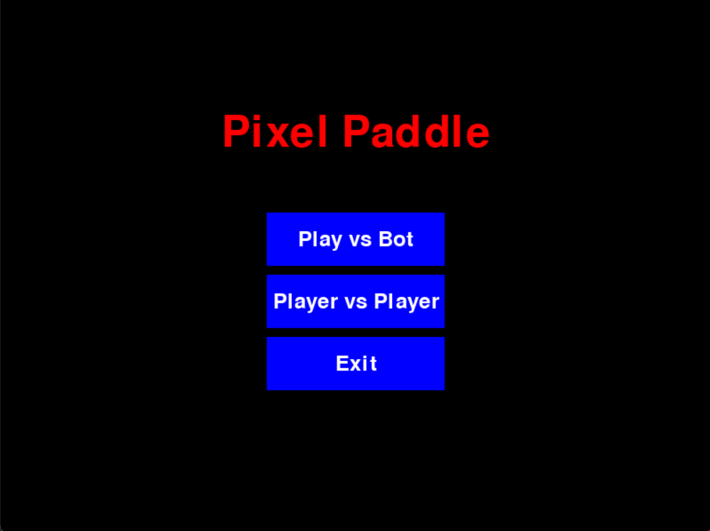
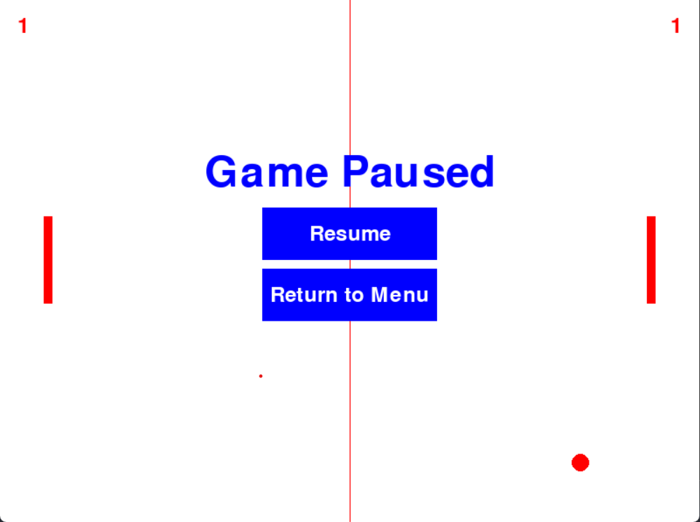
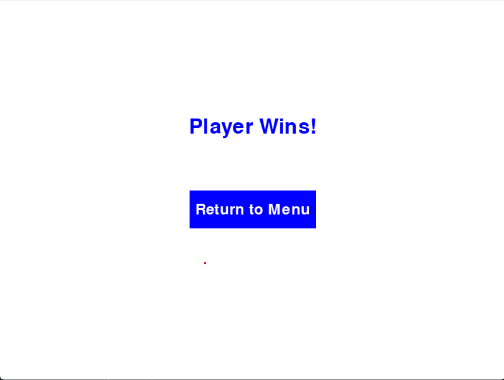
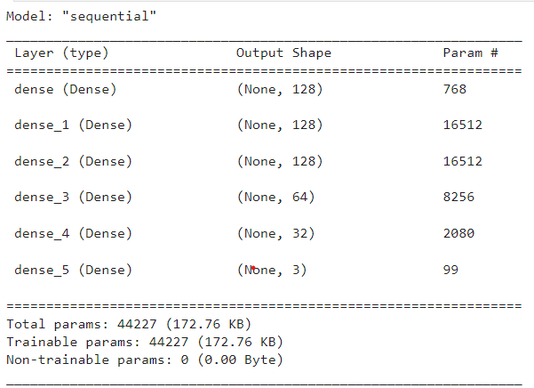
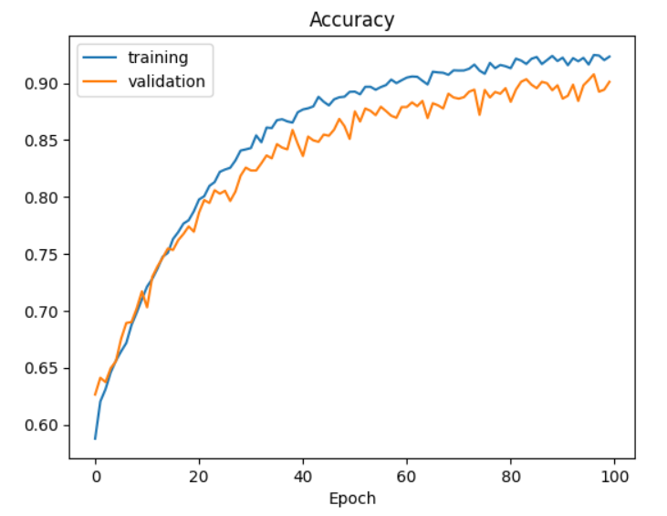

# Pixel Paddle
In this repository, our goal is to make a simple Pong Game with two modes which is PVP and PVE.

Menu...

Ingame...

Victory...

## History
When I decided to make a game with python I picked pygame for for obvious reasons, python and game. But I did not have any experience with pygame and had no idea what game to build. I browsed a bit and I saw pygame based games uses 'rect', and I randomly placed rectengulars on the screen, somehow I likened the image on the screen to a game I know and that game was 'Pong' so I am making 'Pong'. I started with pvp and since I control both players on pvp and it is both difficult and meaningless, I decided to replace one of the players with a bot so I can play by myself, I added pve as a mod. I am studying on machine learning and I want to create a model. I tried a few things, trained a keras model but I did not perform well and lowered the fps so I took it off. I still needed bot, so with simple math I created a bot. That's it.

My model is below...

Model accuracy is shown below...

Model kind of overfits but since accuracy is still low for validation data I did not play with it much.

## Source
All started from here: https://www.pygame.org/docs/
